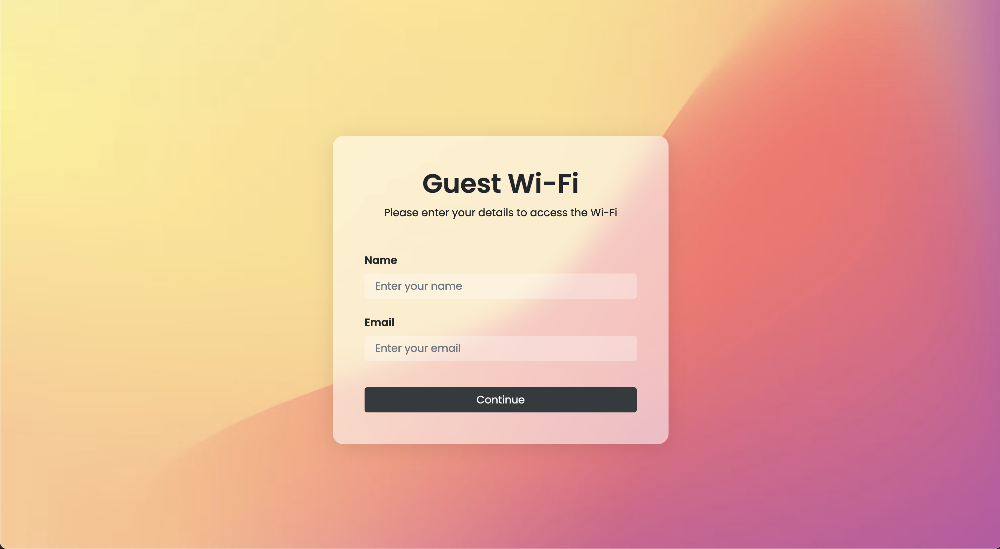

# Meraki Captive Portal with Cloudflare

*Cloudflare: WiFi Captive Portal*  
An Open-Source Meraki Captive Portal using Cloudflare Pages.

## Overview

The Meraki Captive Portal with Cloudflare is an open-source and freely accessible solution for creating customized Captive Portals tailored to Cisco Meraki wireless networks.

Utilizing Cloudflare Pages and the open-source framework of this project, you can effortlessly redirect users to your customized Splash Page, interact with them, and manage internet access as necessary.

Thanks to Cloudflare's reliable usage models, there are no associated fees, subscription costs, or ongoing maintenance requirements, making this solution equally accessible to individuals, small businesses, and organizations.

### Example and Live Demo

Check out what it looks like for end users! Live Demo: https://meraki-excap-cloudflare.pages.dev

Want to try it out in your environment? Configure the following link as your WiFi Splash-Page for an access point or ssid, and you are good to go! ```https://meraki-excap-cloudflare.pages.dev```.



## Installation

### Deploying to Cloudflare

_Prerequisite:_ Create a Cloudflare account www.cloudflare.com.  
_Prerequisite:_ Create a GitHub account www.github.com.  

1. Fork this repository to your GitHub.
2. Rename the forked repo for your desired live page URL.
3. Log in to Cloudflare and navigate to "Workers & Pages" on the sidebar.
4. Click "Create Application," then select the "Pages" tab.
5. Click "Connect to Git" and choose your forked repository.
6. Click "Begin setup" and then "Save and Deploy."
7. Wait about 5 minutes for the initial build.
8. Success! Check it out at ```https://<forked-repo-name>.pages.dev```.

### Configuring Click-Through on Meraki

_Prerequisite:_ Have access to your orgqnizations Meraki Dashboard ([https://meraki.com/dashboard](https://account.meraki.com/secure/login/dashboard_login)).  

1. Go to Meraki Dashboard.
2. Navigate to "Wireless" > "Configure" > "Splash Page"
3. Under "Custom splash URL" enter the splash page url.
4. Navigate to "Wireless" > "Configure" > "Access Control"
5. Under "Security" select "Open (no encryption)"
6. Under "Splash page" select "Click-through"
7. Under "Advanced splash settings" select:
   - Captive portal strength: Block all access until sign-on is complete
   - Walled garden: Enabled
8. Under "Walled garden ranges" enter:
   - *.wifi.direct
   - *.google-analytics.com
   - forked-repo-name.pages.dev
   - fonts.googleapis.com

## Optional: Setup a custom domain name

Setting up a custom domain requires the domain to be added to Cloudflare under the "Websites" tab, as this process will add a new CNAME attribute to the domain's DNS configurations.

Make sure to update the Walled Garden ranges if previosuly configured! Both the cloudflare pages url and the custom domain name will need to be added!

1. Select the "Workers & Pages" tab on the sidebar.
2. Select the pages project you want to set up a custom domain for.
3. Select the "Custom domains" tab in the main section.
4. Click the "Setup a custom domain" button.
5. Enter the domain you want to configure as the custom domain name.
6. Click the "Activate Domain" button at the bottom of the page.
7. Success! Check out your new domain in a few minutes at ```https://<custom-domain>```.

## Updating Your Deployment

Updating your deployment is as easy as it comes!  
Simply commit your changes to the repository used to create the page, and Cloudflare will automatically build and deploy the next version for you! This can be altered, though, to only automatically deploy to a preview branch rather than production.

## Created By
*Adam Spera & Brey Rivera*  
Find us at the links below!  
www.adamspera.dev & www.breyr.dev

## LICENSE
Apache 2.0 (see [LICENSE](./LICENSE)).
